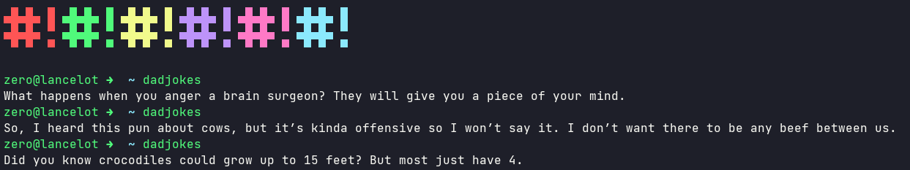

# Dadjokes

[](https://gitmoji.dev)
[](https://goreportcard.com/report/github.com/UltiRequiem/dadjokes)
[](https://opensource.org/licenses/MIT)


Get random dad jokes in terminal.

This project fetch the [icanhazdadjoke API](https://icanhazdadjoke.com/api).



## Installation

```bash
go get github.com/UltiRequiem/dadjokes
```

To be able to execute the command anywhere you need to have correctly setup your [Gopath](https://golang.org/doc/gopath_code).

Example: [Dotfiles](https://github.com/UltiRequiem/dotfiles/blob/53fece48cc95521e67a7a9277d6146aa14fe32f3/.zshrc#L32)

## Usage

```bash
dadjokes
```

### License

This project is Licensed under the [MIT](./LICENSE.md) License.
